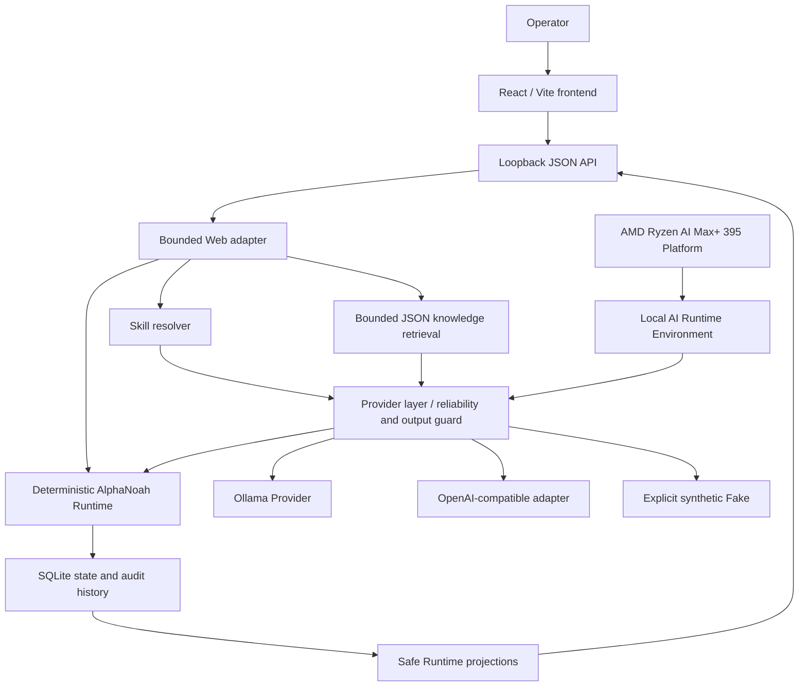

# AlphaNoah A1 Edge Agent

**An industrial edge-agent platform for local AI workflows and private
deployment, validated on AMD Ryzen AI Max+ 395.**

AlphaNoah turns a bounded equipment problem report into structured local AI
analysis and recommended actions. It combines an explicitly selected AI
Provider with a deterministic Runtime, local persistence, and modular Digital
Employee projections.

AlphaNoah helps operators describe real-world equipment problems and receive
structured troubleshooting analysis from a local AI agent.

The AMD Radeon Hackathon demo focuses on one controlled scenario:
**Equipment Fault Troubleshooting**.

```text
Problem Report -> Local AI Analysis -> Structured Diagnosis -> Recommended Actions
```

AlphaNoah is not a chatbot, a SaaS assistant, a generic Agent Framework, or a
cloud-first AI application. It targets customer-controlled local/private
deployment.

## Quick Links

- **Demo Video:** TODO
- **Presentation:** TODO
- **Local Release:** [v0.1.1 AMD Hackathon Final](https://github.com/binc64358-rgb/AlphaNoah-A1-Edge-Agent-Public/releases/tag/v0.1.1-amd-hackathon-final)

## Why AlphaNoah?

Industrial troubleshooting is often slowed by fragmented operating knowledge
and heavy dependence on individual experience. Relevant procedures, equipment
context, and previous observations may exist in different places, while many
AI applications assume continuous cloud connectivity.

Industrial teams need a controlled way to combine local operational context
with AI analysis while retaining authority over data, workflow state, and the
final decision. AlphaNoah explores that boundary with a small, auditable local
Runtime.

## Demo & Presentation

The final video and presentation links will be added to **Quick Links** after
recording and review. The local Linux release is available now.

### Demo Scope

The demonstration follows the four-step flow shown above. An operator reports
an equipment problem; AlphaNoah sends bounded Event, capability, and reviewed
knowledge context to the explicitly selected local AI Provider. The Runtime
validates the response and presents:

- a concise issue summary;
- severity and confidence;
- possible causes;
- recommended actions;
- evidence used and stated limitations.

The source Web scenario accepts a user-editable location that satisfies the
validated location syntax and keeps asset type `air_conditioner`. It remains a
synthetic, controlled equipment fault troubleshooting demonstration. A structured
diagnosis is a preliminary assessment, not a physical inspection, confirmed
root cause, or device-control instruction.

## Why Local AI on AMD?

Industrial incident data can contain equipment identity, operating context,
procedures, and internal observations. Keeping inference close to the
operational environment can support:

- privacy and enterprise data governance;
- lower dependence on wide-area network availability;
- customer control over Provider, model, storage, and data egress;
- a stable local service boundary for operational workflows;
- reduced network latency when the model runs on the local host.

The Public Repository contains an operator-produced direct integration record
for this AMD environment:

| Component | Recorded value |
|---|---|
| Processor | AMD Ryzen AI Max+ 395 |
| Graphics | AMD Radeon 8060S |
| GPU target | `gfx1151` |
| Compute stack | ROCm 7.2 |
| Local model service | Ollama 0.20.3 |
| Model | `qwen3.5:9b` |
| Runtime persistence | Local SQLite |

That record shows one real local Ollama response satisfying the structured
contract, with one Decision and mandatory human review. It is a single-run
integration record, not a performance benchmark or memory-capacity claim.

## Digital Employees

**Digital Employees** provide a human-understandable way to package modular
industrial capabilities. They connect responsibility, an applicable Skill,
and current Event state into a product view for operators.

In the current release:

- Digital Employees are read-only projections derived from persisted Runtime
  facts;
- they are not separately persisted autonomous workers or a second workflow
  engine;
- equipment maintenance is represented by the controlled demonstration;
- safety inspection, quality assistance, and other roles are future
  scenarios, not completed capabilities.

## Why a Purpose-Built Runtime?

AlphaNoah does not attempt to replace general Agent Frameworks. The current
release uses a lightweight purpose-built industrial Runtime to keep the
prototype boundary small and make the following behavior explicit:

- deterministic workflow transitions;
- bounded Provider input and output;
- local deployment and persistence;
- recoverable audit history;
- a mandatory human-control boundary;
- a low Python dependency footprint.

This is not a claim that the Runtime is stronger than LangGraph, Agno, CrewAI,
or other mature infrastructure. Such systems can be evaluated later for
generic orchestration or integration work. AlphaNoah's intended value is the
industrial layer: operational context, Digital Employees, enterprise workflow
boundaries, deployment control, and auditability.

## Architecture



The API and source-development server bind to `127.0.0.1`. The packaged Linux
release serves the built frontend and API through one loopback port. No model
weights are included.

## Capability Status

Status labels in this section have strict meanings:

- **VERIFIED** — exercised by current tests, a release artifact check, or the
  recorded AMD integration run.
- **IMPLEMENTED** — code exists, but a complete target-host path is not
  verified in the Public Repository.
- **PLANNED** — code does not exist as a current release capability.

### Verified

| Capability | Current evidence |
|---|---|
| Deterministic Event, Decision, Human Review, Task, Evidence, final Review, and explicit state transitions | Python Runtime and regression tests |
| SQLite persistence, restart recovery, idempotency, ordered audit history, and safe HTTP projections | Runtime, API, and security tests |
| Explicit Provider selection, structured output guard, bounded retry/deadline, and mandatory human review | Provider and reliability tests |
| Deterministic Skill resolution and bounded JSON knowledge retrieval | Skill and knowledge evaluation tests |
| React frontend using HTTP Runtime data sources | 198 frontend tests and production build |
| Local Ollama analysis on AMD Ryzen AI Max+ 395 / Radeon 8060S | Recorded AMD integration result |
| Linux release archive and one-port static/API composition | Published checksum and packaging integration test |

### Implemented

- The OpenAI-compatible Provider adapter and vLLM-compatible discovery path
  are present and test-harness validated. A real vLLM host is not validated.
- A local notification outbox is persisted. No external delivery channel is
  implemented.
- Source and release scripts support explicit Provider configuration. The
  source launcher supports Ollama and Fake; the packaged release also exposes
  the OpenAI-compatible configuration path.

### Planned

- production authentication, authorization, and multi-user tenancy;
- sensor, camera, and equipment-protocol adapters;
- physical device control and safety-certified automation;
- external notification delivery;
- additional validated safety, quality, and equipment Digital Employees;
- fleet deployment, process isolation, and production observability.

## Technology Stack

| Layer | Current technology |
|---|---|
| Backend | Python 3.11+, standard library |
| Persistence | SQLite |
| Local inference | Ollama Provider |
| Additional Provider boundary | OpenAI-compatible HTTP adapter |
| Frontend | React 19, TypeScript 7, Vite 8 |
| UI libraries | Motion, Lucide React, React Router |
| Tests | `unittest`, Vitest, Testing Library |
| Deployment | Bash scripts; Linux x86_64 release package |

Python has no third-party Runtime dependencies. Frontend dependencies are
locked in `frontend/package-lock.json`.

## Run Locally

Requirements: Python 3.11+, Node.js 22.12+, npm, Bash, and `curl`. Real local
inference also requires Ollama and an installed compatible model.

### From source

```bash
git clone https://github.com/binc64358-rgb/AlphaNoah-A1-Edge-Agent-Public.git
cd AlphaNoah-A1-Edge-Agent-Public
./install.sh
```

For the validated local model path, confirm the exact tag and start both
services:

```bash
ollama list
ALPHANOAH_PROVIDER=ollama \
ALPHANOAH_MODEL=qwen3.5:9b \
./start.sh
```

Open `http://127.0.0.1:5173/events`. The API is available at
`http://127.0.0.1:8090`.

Use `ALPHANOAH_PROVIDER=fake ./start.sh` for the explicit deterministic mode.
It verifies the local application path without a model or public network and
must not be presented as real AI inference.

### Demo steps

1. Open the Events view.
2. Enter a valid location and a synthetic air-conditioner anomaly description.
3. Create the Event.
4. Run **AI Analysis**.
5. Review the structured issue summary, possible causes, confidence,
   limitations, and recommended actions.

### Linux release

The published release contains a built frontend, Python backend, local
configuration flow, operations scripts, and no model weights.

```bash
sha256sum -c SHA256SUMS
tar -xzf AlphaNoah-A1-Edge-Agent-v0.1.1-linux-x86_64.tar.gz
cd AlphaNoah-A1-Edge-Agent-v0.1.1-linux-x86_64
./scripts/install.sh
./scripts/configure.sh
./scripts/start.sh
```

Open `http://127.0.0.1:8090`. Operational commands are provided by
`status.sh`, `healthcheck.sh`, `restart.sh`, and `stop.sh` under `scripts/`.

Detailed release operation and Provider configuration are documented in the
[Local Release Guide](README_LOCAL.md) and
[Provider Setup](PROVIDER_SETUP.md).

## Validation Summary

Fresh local validation of Public Repository commit
`d95272b7b10b15a891ed65833a8c78cc7d0eeffd`:

| Gate | Result |
|---|---:|
| Python tests | 218 passed |
| Python `compileall` | PASS |
| Release static/API integration test | 1 passed |
| Frontend tests | 198 passed across 34 files |
| TypeScript typecheck | PASS |
| Vite production build | PASS |
| Main JavaScript bundle | 546.97 kB minified; size warning only |

Release facts:

- Tag: `v0.1.1-amd-hackathon-final`
- Public tag commit: `1a32a8c071beb2ab63d0232a03f6f8baf299ca73`
- Artifact: `AlphaNoah-A1-Edge-Agent-v0.1.1-linux-x86_64.tar.gz`
- SHA-256: `8a0e44b72c4e6e48013d1fe7819796dfc031fb15bba5d9c3dfeb626427f4a7b5`
- Anonymous repository, Release, and artifact access are recorded as passing
  in the Public Repository publication status.

The current repository contains no GitHub Actions workflow. The results above
were run manually against the checked-out Public Repository.

## Privacy and Deployment Boundary

AlphaNoah targets customer-controlled local/private deployment.

- Local Ollama on loopback keeps the application inference request on the
  host.
- A private-LAN compatible endpoint uses that enterprise network boundary.
- A remote compatible endpoint may transmit Event, knowledge, and analysis
  context outside the local environment.
- Provider selection is explicit; unavailable configured Providers do not
  silently fall back to Fake.
- SQLite data remains local to the configured host filesystem.
- Safe projection contracts exclude prompts, credentials, local paths, raw
  audit details, and internal Provider responses.

A hosted Web Demo is only a **UI and interaction reference**. It is not the
recommended production deployment and cannot prove local/private inference.
The current service has no production authentication or multi-user
authorization, so loopback binding and host security are part of the present
boundary.

## Repository Structure

| Path | Purpose |
|---|---|
| `src/alphanoah_a1/` | Python backend Runtime, API, storage, Providers, Skills, knowledge, and projections |
| `frontend/` | React/Vite interface, HTTP data sources, and frontend tests |
| `tests/` | Backend regression, security-boundary, API, and packaging tests |
| `scripts/` | Native Linux release install, configure, operations, health, and packaging tools |
| `config/` | Sanitized local configuration examples |
| `examples/` | Synthetic Event, responsibility, evidence, and knowledge fixtures |
| `docs/` | Current evidence plus historical architecture and design records |
| `benchmarks/` | Reserved directory; no benchmark result is shipped |
| `RELEASE_INFO.txt` | Public release identity and archive checksum |

Historical documents explain project evolution but are not evidence that a
capability is implemented. Current code, tests, configuration, and release
artifacts take precedence.

## Known Limitations

- The source Web demo accepts validated location identifiers and remains
  deliberately constrained to `air_conditioner` equipment fault troubleshooting.
- The structured result is advisory and cannot confirm a physical fault.
- There is no production sensor input, device control, external notification
  delivery, identity system, or process sandbox.
- Real Ollama inference is recorded; real vLLM and remote API hosts are not
  host-validated by this Public Release.
- The source launcher is Bash-oriented, and the packaged native release is
  Linux x86_64.
- `npm audit` currently reports two high-severity dependency findings.
- The production frontend build emits a non-blocking bundle-size warning.
- The generic workflow page has no dedicated end-to-end browser test.

## Future Direction

AlphaNoah's longer-term direction is documented separately in
[Future is Robots](docs/vision/future-is-robots.md). It describes planned
context, sensor, vision, equipment-data, and Physical AI layers. This is future
direction only, not a Hackathon completion claim.

## Repository Notes

The repository uses an all-rights-reserved placeholder `LICENSE`; no
open-source permission is currently granted.

## Submission Materials

- **Demo Video:** TODO
- **Presentation:** TODO
- **Local Release:** [v0.1.1 AMD Hackathon Final](https://github.com/binc64358-rgb/AlphaNoah-A1-Edge-Agent-Public/releases/tag/v0.1.1-amd-hackathon-final)
