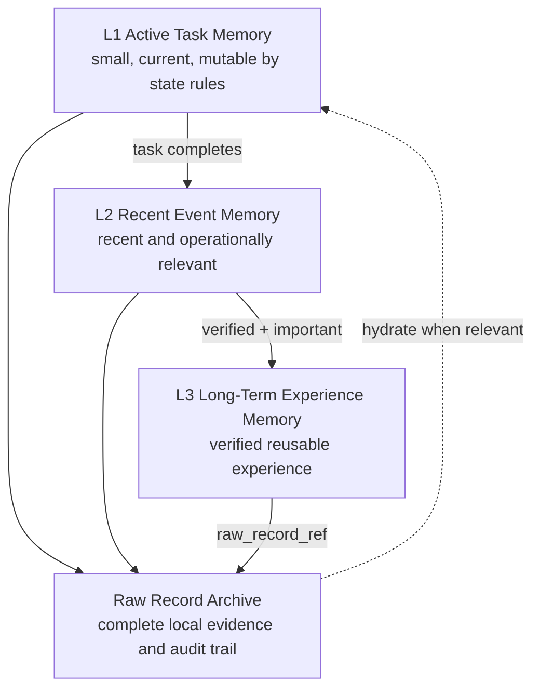
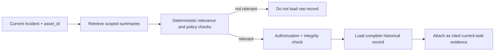

# A1 Event Memory Engine

> **AlphaNoah A1 Edge Agent** — *An AMD ROCm-powered industrial asset maintenance edge agent.*

Document status: planned architecture for hackathon v0.1. This document defines system-level memory behavior; it does not claim model-internal memory has been implemented.

Phase note (2026-07-23): the advanced memory layers remain paused. The current
runtime implements only durable SQLite domain records and an audit timeline; see
[Audit and History](AUDIT_AND_HISTORY.md).

## 1. Goal

A1 不会把全部历史记录塞入模型上下文。它先在确定性代码中按资产、时间、状态和事件价值筛选记录，再决定哪些信息保持活跃、哪些形成摘要、哪些仅保留原始记录指针，以及何时按需恢复完整历史。

This design has four goals:

1. keep prompts bounded and relevant;
2. prevent one asset's history from contaminating another asset's context;
3. preserve an auditable raw record while keeping active context compact;
4. promote only human-confirmed and verification-supported outcomes into reusable experience.

`Event Importance Score` is an explainable system-level score. It is not Surprise Attention, a Transformer modification, or a measure read from model internals.

## 2. Memory Layers



### 2.1 L1 Active Task Memory

L1 is the minimum state required to execute and resume the current workflow:

- active `asset_id` and asset display label;
- current work order and state-machine version;
- current conversation turns needed for the task;
- current Skill command and status;
- missing-information questions;
- pending approval or verification request;
- current evidence references and last checkpoint;
- retry count, timeout deadline and failure reason.

L1 is not a free-form chat transcript. Only schema-approved fields enter a model request. When the task closes or expires, L1 is reduced into event records and references rather than retained indefinitely as active context.

### 2.2 L2 Recent Event Memory

L2 supports near-term operational continuity for the selected asset:

- recent incidents;
- open and recently closed work orders;
- latest repairs and verification observations;
- recent unsuccessful attempts;
- recent similar events;
- unresolved approvals or escalations.

Retrieval is first filtered by `asset_id`, then by status and time window, then ranked by deterministic relevance. L2 may include model-generated summaries only when they are clearly labeled as summaries and linked to raw records.

### 2.3 L3 Long-Term Experience Memory

L3 contains reusable, verification-supported experience:

- human-confirmed root causes;
- solutions whose outcomes were successfully verified;
- ineffective solutions that should not be repeated blindly;
- high-value historical events;
- approved simulated SOP or manual references;
- reusable experience summaries with provenance.

An L3 record must identify the source work order, verification result, asset or compatible asset class, timestamps, author/approver and raw-record pointer. A model suggestion without subsequent evidence is ineligible.

### 2.4 Raw Record Archive

The raw archive retains the local source of truth:

- complete employee descriptions;
- complete repair submissions;
- attachment references and hashes;
- original work-order records;
- state transitions, approvals and audit logs;
- model request/response references subject to retention policy.

Raw data stays local by default. The archive is not automatically inserted into prompts and is not automatically synchronized to a future server.

## 3. Event Importance Score

The score is a deterministic, explainable ranking aid. It can guide retention, review priority and retrieval, but it does not authorize an action or replace a safety policy.

### 3.1 Factors

| Factor | Question answered | Example evidence in the simulated design |
|---|---|---|
| Severity | How serious is the observed incident? | stop, degraded operation, informational anomaly |
| Recurrence | Has the same or similar event repeated? | event count within an explicit time window |
| Downtime Impact | How much operation is interrupted? | submitted duration or production-state category |
| Safety Impact | Could people, assets or environment be harmed? | deterministic hazard flags requiring review |
| Novelty | Is this unlike the asset's recent verified history? | feature/rule comparison against scoped history |
| Experience Value | Would the verified outcome be reusable? | new confirmed root cause or effective resolution |

### 3.2 Conceptual calculation

```text
importance = policy_versioned_weighted_sum(
    severity,
    recurrence,
    downtime_impact,
    safety_impact,
    novelty,
    experience_value
)
```

Each factor is normalized by deterministic code and includes its evidence. Weights and thresholds are policy-versioned, not authored by the model at runtime. The model may propose extracted facts, but code validates allowed values and computes the score. No production weight or customer threshold is defined in this public design.

### 3.3 Intended uses

- deciding whether a recent record needs a richer summary;
- prioritizing similar-event retrieval;
- flagging a record for human review;
- determining whether verified experience is a candidate for L3;
- selecting an inspection cadence recommendation for future evaluation.

It must not be presented as a universal risk score or a performance metric.

## 4. Archival and Tombstone Records

When a record becomes inactive, A1 may replace its active representation with a compact tombstone while retaining the raw record locally.

A tombstone contains:

- `memory_id` and schema version;
- `asset_id`;
- event or work-order time range;
- short factual summary;
- controlled keywords;
- Event Importance Score and factor explanation;
- verification status;
- `raw_record_ref` and integrity hash;
- retention and access labels.

Tombstoning is compaction, not deletion and not model forgetting. The raw record remains the authoritative evidence until a separate retention policy deletes it.

## 5. Hydration

Hydration restores full history only when a compact record appears relevant to the current asset and task.



Hydrated records are read-only evidence for the current task. Their original event, verification and asset identity remain visible. Hydration does not merge histories or silently rewrite the old record.

## 6. Context Isolation

The QR-resolved `asset_id` is the primary context boundary.

Required guards:

- resolve and validate `asset_id` before any memory query;
- include `asset_id` in every task, work order, event, memory and evidence key;
- deny retrieval when a record's scope does not match the active asset, unless an explicit asset-class knowledge rule allows a non-sensitive reusable summary;
- never use a model instruction to override the scope;
- record attempted scope violations in the audit trail;
- clear transient model context when switching assets.

Cross-asset reusable experience, if introduced later, must be separately classified, de-identified, approved and linked to its provenance. It is not part of the initial single-asset demo.

## 7. Experience Update

Only verified outcomes can become long-term experience.

```text
repair result submitted
→ verification plan selected by deterministic policy
→ observation period completed
→ VerificationResult recorded
→ human confirmation where required
→ experience candidate generated
→ schema/provenance/policy checks
→ L3 experience record created or rejected
```

The model may draft `ExperienceSummary`, but deterministic code must attach the supporting work order and verification evidence. If verification fails, the attempted fix is recorded as an ineffective or unresolved attempt; it is never promoted as a successful solution.

## 8. Failure and Recovery Semantics

| Failure | Required behavior | Recoverability |
|---|---|---|
| Missing asset context | Block retrieval and request valid identification | Recoverable after identification |
| Corrupt raw reference or hash mismatch | Do not hydrate; log integrity error | Requires operator review |
| Model summary fails schema | Keep raw record; retry formatting once at most | Usually recoverable |
| No relevant memory | Continue without invented history | Recoverable |
| Verification evidence missing | Keep work order pending; do not promote experience | Recoverable after evidence |
| Asset context changes mid-task | Interrupt, checkpoint and require explicit new task | Recoverable through restart in correct context |

## 9. Privacy, Retention and Audit

- This public repository must contain only simulated records.
- Raw text and attachment paths are not exposed in public logs.
- Retrieval logs record IDs and reason codes, not unnecessary raw content.
- Tombstones and summaries retain provenance and verification state.
- Retention policy is a deterministic configuration and remains a future design item; the model cannot delete records.
- Future synchronization should send only approved, minimized records and never assume raw archive upload.

## 10. Current Implementation Boundary

The repository now contains SQLite domain persistence and an audit timeline for the
implemented food-SOP workflow. It does not implement this document's L1/L2/L3
stores, scoring, tombstones, hydration, vector search, embeddings, adaptive
maintenance intervals or experience promotion. In particular, it does not implement:

- Transformer or Attention changes;
- Surprise Attention;
- KV Cache movement across VRAM, RAM and SSD;
- gradient-reversible memory;
- new model training;
- parameter-level long-term memory;
- vLLM kernel modifications.

The early Grey-Space / Phantom Memory ideas are adapted only as system-engineering metaphors and boundaries. See [Design Inspirations](../research/DESIGN_INSPIRATIONS.md) for attribution.
