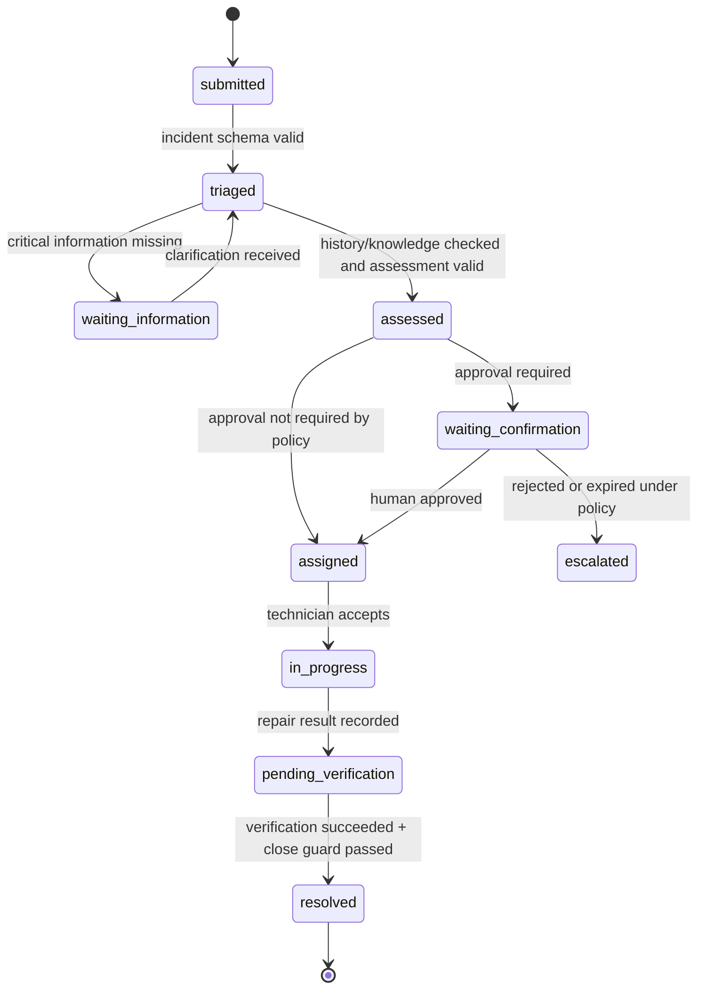
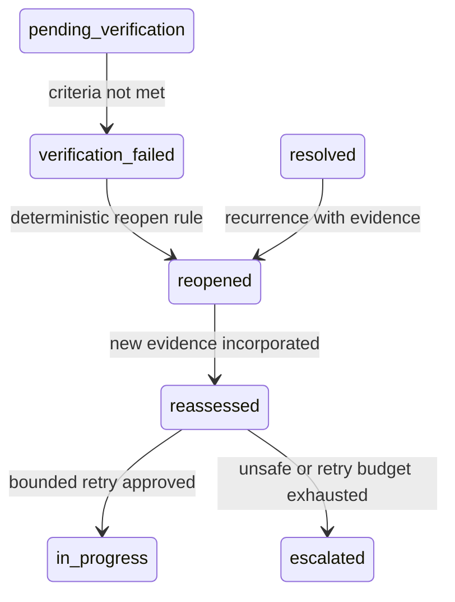

# A1 Typed Skills and Maintenance Workflow

> **AlphaNoah A1 Edge Agent** — *An AMD ROCm-powered industrial asset maintenance edge agent.*

Document status: interface and workflow design for hackathon v0.1. No Skill runtime or business implementation is claimed by this document.

Phase note (2026-07-23): the broad maintenance Skill catalog remains designed
only. One smaller food-SOP Skill and deterministic runtime are now implemented;
see [Skill Model](SKILL_MODEL.md) and [Core Runtime](CORE_RUNTIME.md).

## 1. Design Principles

A1 models maintenance operations as typed, observable Skills rather than unconstrained model-generated tool calls.

- Every Skill has declared input and output schemas.
- Preconditions are checked by deterministic code.
- Model output is untrusted until schema and policy validation succeed.
- A Skill returns status and evidence; it does not silently mutate unrelated state.
- Work-order state changes occur only through guarded deterministic transitions.
- High-impact actions pause at a persisted human-confirmation gate.
- Retries are bounded, failures are explicit, and recovery remains auditable.

The design is inspired by typed-tool and persistent-state patterns found in Agent frameworks, but the planned v0.1 runtime is framework-independent and is not built with LangChain or LangGraph.

## 2. Common Skill Contract

### 2.1 Command envelope

| Field | Meaning |
|---|---|
| `command_id` | Unique idempotency identifier |
| `task_id` | Owning maintenance task |
| `work_order_id` | Optional work-order identity |
| `asset_id` | Required context boundary |
| `skill_name` | Allow-listed Skill name |
| `schema_version` | Input/output contract version |
| `requested_by` | Employee, system rule or authorized human actor |
| `input` | Schema-validated Skill input |
| `deadline` | Deterministic timeout boundary |
| `trace_id` | Audit and correlation identifier |

### 2.2 Status envelope

```json
{
  "skill_name": "",
  "status": "success | failed | blocked | waiting_human",
  "progress": 0.0,
  "confidence": 0.0,
  "recoverable": true,
  "latency_ms": 0,
  "evidence": {},
  "failure_mode": null,
  "error_code": null
}
```

Semantics:

- `progress` is deterministic workflow progress, not model confidence.
- `confidence` is optional and Skill-specific; it must not be used as authorization.
- `evidence` contains typed references or safe structured observations, not arbitrary executable content.
- `failure_mode` classifies how execution failed and is distinct from the stable implementation-facing `error_code`.
- `waiting_human` is a persisted interruption, not a successful completion.
- `failed` requires a stable `error_code`; free-form exception text stays in protected local logs.

## 3. Skill Catalog: Contract and Effect

The schema names below define proposed contracts. They are not claims that corresponding Pydantic classes already exist.

| Name | Purpose | Input schema | Output schema | Preconditions | Expected effect |
|---|---|---|---|---|---|
| `identify_asset` | Resolve QR input to a stable asset identity | `AssetIdentityInput{qr_payload, actor_id}` | `AssetIdentityResult{asset_id, asset_type, context_version}` | QR format valid; actor may view asset | Activates one asset-scoped context; no work order yet |
| `parse_incident` | Extract a structured incident candidate from employee text | `IncidentTextInput{asset_id, text, locale}` | `IncidentDraft{symptoms, onset, recurrence, missing_fields}` | Active asset; non-empty bounded text | Stores a draft only after schema validation |
| `request_clarification` | Ask one bounded question for missing critical information | `ClarificationInput{incident_id, missing_fields}` | `ClarificationRequest{question, requested_fields}` | Required field missing; question budget available | Moves task to `waiting_information` |
| `retrieve_asset_history` | Retrieve recent and relevant local events for the active asset | `HistoryQuery{asset_id, incident_features, limit}` | `HistoryResult{record_refs, summaries, provenance}` | Asset scope validated; local store healthy | Adds cited local history evidence; no state decision |
| `retrieve_sop` | Retrieve approved simulated guidance for the asset/type | `SopQuery{asset_id, asset_type, topic}` | `SopResult{document_refs, excerpts_safe, version}` | Asset scope valid; document allow-listed | Adds cited simulated knowledge; does not execute instructions |
| `assess_incident` | Classify the incident and combine validated facts, history and policy factors into a risk/next-step proposal | `AssessmentInput{incident, history_refs, sop_refs}` | `AssessmentResult{category, risk_flags, recommendation, uncertainty, missing_evidence}` | Required retrieval steps completed or explicitly unavailable | Moves toward `assessed` only after schema and policy validation |
| `create_work_order` | Create an idempotent local work order | `CreateWorkOrderInput{asset_id, incident_id, assessment_id}` | `WorkOrderCreated{work_order_id, state, created_at}` | Assessment valid; no duplicate idempotency key | Deterministic database insert and state transition |
| `request_approval` | Persist an approval request before a high-impact step | `ApprovalRequestInput{work_order_id, proposed_action, risk}` | `ApprovalRequest{approval_id, state, approver_role}` | Work order eligible; policy requires approval | Moves to `waiting_confirmation`; execution pauses |
| `record_repair_result` | Record a technician's claimed physical action and observations | `RepairResultInput{work_order_id, actor_id, actions, observations}` | `RepairResultRecorded{result_id, evidence_refs}` | Work order `in_progress`; authorized human | Persists an unverified repair result |
| `verify_recovery` | Evaluate whether the declared recovery criteria were met | `VerificationInput{work_order_id, result_id, observations, window}` | `VerificationResult{outcome, criteria, evidence_refs}` | Repair result exists; observation window complete | Moves to `resolved` candidate or `verification_failed` |
| `close_work_order` | Close a verified work order | `CloseInput{work_order_id, verification_id, approval_id?}` | `WorkOrderClosed{work_order_id, closed_at}` | Verification succeeded; required human approval present | Deterministic transition to `resolved` |
| `reopen_work_order` | Reopen after failed verification or recurrence | `ReopenInput{work_order_id, reason, evidence_refs}` | `WorkOrderReopened{state, attempt}` | Previously pending/resolved order; allowed reason | Creates audited transition to `reopened` |
| `escalate_work_order` | Escalate when local recovery is unsafe or exhausted | `EscalationInput{work_order_id, reason_code, evidence_refs}` | `EscalationResult{state, target_role}` | Escalation rule matched or authorized human requested | Marks `escalated`; no autonomous external dispatch in v0.1 |
| `summarize_experience` | Draft a reusable summary from verified records | `ExperienceDraftInput{work_order_id, verification_id}` | `ExperienceDraft{root_cause, effective_action, limitations, provenance}` | Successful or informative failed verification exists | Produces a draft; does not update L3 directly |
| `update_memory` | Promote an eligible verified event into the correct memory layer | `MemoryUpdateInput{experience_draft, importance, evidence_refs}` | `MemoryUpdateResult{memory_id, layer, raw_record_ref}` | Provenance complete; policy and approval checks pass | Deterministic, asset-scoped memory write |

## 4. Skill Catalog: Status, Failure and Evidence

| Name | Possible status | Principal failure modes | Recoverability | Required evidence | Human confirmation |
|---|---|---|---|---|---|
| `identify_asset` | success, failed, blocked | malformed QR; unknown asset; unauthorized actor | New scan or authorized registration | QR hash, resolved `asset_id`, resolver version | No for lookup; yes for identity override |
| `parse_incident` | success, failed, blocked | empty/oversized text; model timeout; invalid schema | One format retry, then manual structured input | original text ref, model metadata, schema result | No |
| `request_clarification` | success, blocked, waiting_human | question budget exhausted; employee unavailable | Resume on employee response or escalate | missing-field list, question, response | Employee response required |
| `retrieve_asset_history` | success, failed, blocked | store unavailable; scope mismatch; corrupt record | Retry once or continue with explicit unavailable marker | query scope, record IDs, provenance | No |
| `retrieve_sop` | success, failed, blocked | no approved document; version mismatch; access denied | Continue only if policy allows, otherwise escalate | document ID/version and safe excerpt refs | No; human may select approved document |
| `assess_incident` | success, failed, blocked | missing evidence; inconsistent facts; policy error | Clarification or human triage | factor values, history/SOP refs, policy version | Human required for high-risk interpretation |
| `create_work_order` | success, failed, blocked | duplicate; database failure; invalid state | Idempotent retry after store recovery | incident/assessment IDs, idempotency key, audit event | No if policy permits creation |
| `request_approval` | failed, blocked, waiting_human | approver unavailable; expired request; conflicting decision | Reissue under policy or escalate | proposed action, risk, actor, timestamp, decision | **Always** for gated action |
| `record_repair_result` | success, failed, blocked, waiting_human | unauthorized actor; missing observations; invalid state | Correct submission and resume | actor, declared actions, observation refs | **Always human-authored** |
| `verify_recovery` | success, failed, blocked, waiting_human | observation window incomplete; conflicting signals; missing evidence | Wait, collect evidence, reopen or escalate | criteria, measurements/observations, timestamps | Human confirms physical outcome where required |
| `close_work_order` | success, failed, blocked | verification absent; approval absent; transition invalid | Complete gate; never force close via model | verification ID, approval if required, audit transition | Required by configured risk policy |
| `reopen_work_order` | success, failed, blocked | invalid reason; already active; scope mismatch | Correct evidence or escalate | recurrence/failure evidence and prior order | Human may initiate; policy may auto-propose only |
| `escalate_work_order` | success, failed, blocked, waiting_human | target role missing; policy mismatch | Persist locally and request manual handling | reason code, attempts, risk and evidence | Required for high-impact external escalation |
| `summarize_experience` | success, failed, blocked | unverified source; unsupported claim; schema error | Correct sources; one format retry | verified source IDs and provenance | Human review before high-value promotion |
| `update_memory` | success, failed, blocked | verification missing; scope mismatch; duplicate; store error | Idempotent retry or reject candidate | verification, importance factors, summary provenance | Required when policy marks sensitive/high value |

## 5. Work-order State Machine

### 5.1 Primary path



### 5.2 Failure and recovery path



`waiting_information`, `waiting_confirmation`, `verification_failed`, `reopened`, `reassessed` and `escalated` are first-class states, not free-form notes.

The `reassessed → in_progress` branch represents a bounded retry. When no safe recovery exists, the workflow must enter `blocked` or `escalated`; the model cannot keep the task in an unbounded loop.

## 6. Transition Guards

| Transition | Required guard |
|---|---|
| `submitted → triaged` | incident is schema-valid and bound to an active asset |
| `triaged → assessed` | required evidence present or unavailable state explicitly accepted |
| `assessed → waiting_confirmation` | policy detects an approval requirement |
| `waiting_confirmation → assigned` | valid, unexpired approval by allowed role |
| `in_progress → pending_verification` | human repair result recorded with evidence |
| `pending_verification → resolved` | verification succeeded and close policy passed |
| `pending_verification → verification_failed` | verification explicitly failed, not merely timed out |
| `verification_failed → reopened` | failure evidence retained and attempt incremented |
| `reassessed → in_progress` | retry budget remains and risk policy permits |
| `reassessed → escalated` | retry exhausted, unsafe condition or human decision |

Only deterministic code evaluates and commits these guards. The LLM may recommend a transition, but it cannot execute one.

## 7. Scheduler Rules

The planned Skill Scheduler is bounded:

1. load persisted task state;
2. determine the small allow-list of Skills valid for that state;
3. validate one typed command;
4. execute the deterministic or model-assisted Skill with timeout;
5. validate its status envelope and evidence;
6. commit an allowed transition or persist a failure/interruption;
7. stop on human gate, terminal state or step budget.

It does not accept arbitrary Python, shell commands, downloaded plugins or model-invented Skill names.

## 8. Retry, Timeout and Idempotency

- Model formatting failures may be retried once with the validation error and the same bounded schema.
- Database writes use `command_id` or an equivalent idempotency key.
- A timeout returns a stable failure state; it does not imply the underlying effect occurred.
- Human approval requests expire explicitly and cannot be reused across a changed action.
- Reopen/retry increments an attempt counter and preserves previous evidence.
- Retry budgets are per Skill and policy-versioned; the model cannot increase them.

## 9. Audit Requirements

Every Skill attempt records:

- command, task, work order, asset and trace IDs;
- actor and authorization decision;
- schema and policy versions;
- start/end time and latency;
- status, stable error code and recoverability;
- input/output hashes or safe evidence references;
- pre-state, proposed transition and committed post-state;
- approval and verification references where applicable;
- local model/backend metadata for model-assisted Skills.

## 10. Current Implementation Boundary

This document remains a design contract for the broad maintenance catalog. The
repository now contains an AlphaNoah state machine, SQLite tables, one food-SOP
Skill, CLI human approval and a deterministic post-task review. It still does not
contain this document's maintenance Skill catalog, Pydantic schemas, scheduler,
approval UI or model adapter. Only behavior identified as Implemented in the
current architecture documents may be presented as operational.
