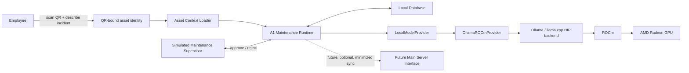
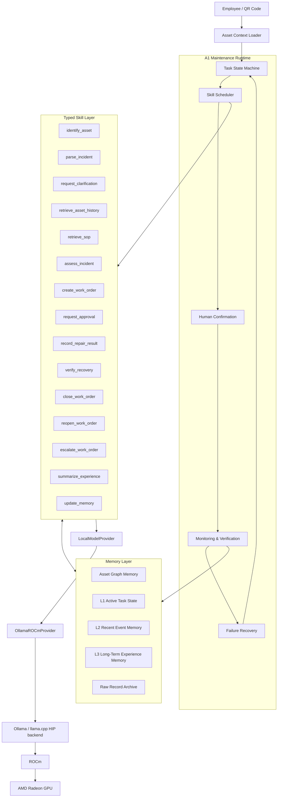

# AlphaNoah A1 System Architecture

> **AlphaNoah A1 Edge Agent** — *An AMD ROCm-powered industrial asset maintenance edge agent.*

中文定位：基于 AMD Radeon GPU 与 ROCm 的工业资产闭环运维边缘智能体。

Document status: architecture design for hackathon v0.1. Unless explicitly marked as an audited runtime baseline, the components below are planned and are not yet implemented in this repository.

Phase note (2026-07-23): this packaging-equipment architecture is preserved as a
planned extension, not the primary demo. The implemented food-SOP closed loop is
documented in [AlphaNoah System Overview](ALPHANOAH_SYSTEM_OVERVIEW.md).

## 1. System Goal

AlphaNoah A1 是部署在企业现场的边缘 Agent 节点。它通过二维码把现实设备与稳定的 `asset_id` 绑定，在本地完成故障描述理解、设备历史与模拟 SOP 检索、类型化运维 Skill 调度、工单状态控制、人工确认、维修结果验证和经验沉淀。

一句话介绍：

> AlphaNoah A1 通过二维码为现实设备绑定数字身份，在企业现场完成本地故障理解、设备历史检索、类型化运维 Skill 调用、人工确认、结果验证和设备经验沉淀。

A1 不是完整的企业资产管理平台，也不是机器人控制系统。它不负责企业级多节点管理、商业 Skill 分发、机器人导航、机械臂操作或现场维修本身。黑客松 v0.1 的目标是证明一个边界明确、可审计、可恢复的本地闭环，而不是覆盖全部企业运维流程。

核心原则：

> LLMs interpret and recommend; deterministic code controls state and execution; humans approve high-impact actions and verify physical outcomes.

## 2. System Context

### 2.1 Actors and systems

| Actor or system | Role in the design | Trust boundary |
|---|---|---|
| Employee | 扫描二维码、描述故障、补充缺失信息 | 输入不可信，必须校验与审计 |
| QR Code | 携带或解析到稳定的 `asset_id` | 只是身份入口，不能直接授予权限 |
| Physical Asset | 被维护的现实设备 | 通过 `asset_id` 与数字上下文关联 |
| A1 Local Node | 运行状态机、Skill 调度、确认门、验证与本地记忆 | 核心可信边界 |
| Local Model | 提取 Incident、解释与提出建议 | 输出不可信，必须经过 Schema 和策略校验 |
| Local Database | 保存任务、工单、事件、审批、验证和审计记录 | 默认不离开现场节点 |
| Simulated Maintenance Supervisor | 黑客松中执行人工批准或拒绝 | 演示角色，不代表真实组织流程 |
| Future Main Server Interface | 未来用于多节点管理和最小化同步 | v0.1 不是关键执行路径，可断网运行 |

### 2.2 Primary context flow

The QR code selects an asset context; it does not execute an action. The model proposes structured interpretations; it does not commit state transitions. The future server is outside the local decision loop and cannot be required for the hackathon offline path.

## 3. Core Architecture

### 3.1 Runtime responsibilities

- **Task State Machine** owns valid states and guarded transitions.
- **Skill Scheduler** selects only allow-listed, typed Skills whose preconditions are satisfied.
- **Human Confirmation** interrupts execution before high-impact actions and resumes only from a persisted approval record.
- **Monitoring & Verification** records expected outcomes and evaluates submitted observations.
- **Failure Recovery** applies bounded retry, clarification, reopen or escalation rules. It is not unconstrained autonomous replanning.

### 3.2 Provider boundary

`LocalModelProvider` is the model-facing port. The Agent Core must not import Ollama-specific objects or assume a particular wire protocol. `OllamaROCmProvider` is the planned hackathon adapter because the supplied single-machine audit identifies it as the lowest-risk current route. A future vLLM, Transformers or another local backend would replace the adapter without changing domain objects or state rules.

## 4. Responsibility Boundary

### 4.1 LLM responsibilities

The local LLM may:

- interpret the employee's fault description;
- extract a structured Incident candidate;
- identify missing or ambiguous information;
- explain retrieved history or simulated SOP material;
- propose a risk interpretation and next-step recommendation;
- generate a draft experience summary from verified records.

Every output is a proposal. It must pass a declared JSON/Pydantic schema and deterministic policy checks before use.

### 4.2 Deterministic code responsibilities

Deterministic code exclusively controls:

- state transitions and transition guards;
- database writes and idempotency;
- authorization and asset-context checks;
- work-order creation and identifiers;
- human-confirmation gates;
- close, reopen, retry and escalation actions;
- audit logs and checkpoint persistence;
- schema validation, timeout and bounded retry;
- evidence references and experience-promotion rules.

The LLM cannot directly write `resolved`, approve its own recommendation, change an `asset_id`, or mark a result as verified.

### 4.3 Human responsibilities

Humans remain responsible for:

- performing physical inspection and repair;
- approving high-impact actions;
- reporting what was actually changed;
- confirming post-repair observations;
- providing final approval where site policy requires it.

The hackathon supervisor and technician interactions are simulated. No document in this repository defines a real customer's approval policy or SOP.

## 5. Framework Independence

A1 v0.1 is informed by established Agent orchestration patterns but does not use LangChain or LangGraph as a critical runtime dependency.

The following domain objects must not depend on LangChain or LangGraph types:

- `Asset`
- `Incident`
- `WorkOrder`
- `SkillCommand`
- `SkillStatus`
- `Approval`
- `VerificationResult`
- `MemoryRecord`
- `EventImportance`
- `ExperienceSummary`
- `ExecutionEvidence`
- `FailureMode`

If a framework is evaluated later, it must enter through an orchestration adapter. Domain schemas, state invariants, persistence records and Provider contracts remain framework-independent. This permits a future adapter to be removed without migrating core business records. This documentation round records that adapter boundary only; it does not create an empty or fake adapter implementation.

The planned hackathon implementation pattern is a small Python deterministic state machine, Pydantic schemas, SQLite checkpoints, typed Skills, explicit interrupt/resume, bounded retry and auditable transitions. These are design decisions, not claims that this repository already contains the runtime.

## 6. Server and Edge Boundary

### 6.1 A1 Edge responsibilities

- accept on-site employee input;
- resolve a QR code to an `asset_id`;
- load only the selected asset's local context;
- perform local model inference;
- manage the active task and local work order;
- retrieve local history and simulated knowledge;
- persist approvals, traces and verification results;
- retain a local, asset-scoped audit trail;
- operate when disconnected from the network;
- prepare a future minimal synchronization envelope without making sync mandatory.

### 6.2 Future Main Server responsibilities

- multi-node inventory and health management;
- Skill package lifecycle and signed distribution;
- enterprise identity and permission policy;
- long-term aggregation and governance;
- cross-node coordination;
- approved model and Skill distribution;
- node software and contract-version management;
- commercial private capabilities outside the public hackathon repository.

The public A1 design does not describe private server internals, customer-specific rules or cross-enterprise learning logic.

## 7. Future Embodiment Boundary

Current A1 does not control a robot. It has no ROS2 integration, perception stack, spatial map, motion controller or actuator path.

The deliberate long-term boundary is that `Asset`, task state, typed Skill status, execution evidence, verification, failure recovery and memory provenance can remain useful if a later system adds sensors or a robot body. Future physical Skills must still pass deterministic validation, safety policy, monitoring, verification and human approval where required; an LLM must never become a motor controller.

The complete staged route and current-to-future interface mapping are documented in [Future Is Robots? — From Enterprise Agent to Embodied Robot](../future-is-robots/ENTERPRISE_AGENT_TO_ROBOT.md). This file does not repeat that roadmap.

## 8. Security and Data Boundary

- QR input is validated before resolving `asset_id`; unknown or malformed identities are blocked.
- Every read and write is scoped by the active `asset_id`; histories from different assets cannot be mixed.
- Local model output is treated as untrusted structured input.
- Raw records, simulated SOPs and attachments stay local by default.
- High-impact actions require a persisted human decision.
- Audit entries are append-oriented and identify actor, state, command and evidence.
- The hackathon repository may contain only simulated assets, simulated SOPs and simulated work orders.

## 9. v0.1 Scope and Non-goals

### Planned v0.1 scope

- one simulated packaging asset (`PACK-003`);
- one bounded maintenance workflow with success and failure branches;
- one local model Provider path through Ollama and ROCm;
- typed Skills, local state, local memory and an explicit human gate;
- verification-driven close/reopen and observable latency/GPU evidence.

### Not implemented or out of scope

- production authorization and enterprise deployment;
- real customer, factory, device or SOP data;
- LangChain or LangGraph runtime integration;
- vLLM migration;
- ROS2, 3D maps, navigation, robotic manipulation, VLA or multi-robot coordination;
- model training, model-internal memory or autonomous high-risk execution;
- a complete AlphaNoah commercial main server.

## 10. Related Documents

- [Event Memory Engine](A1_EVENT_MEMORY_ENGINE.md)
- [Skills and Workflow](A1_SKILL_AND_WORKFLOW.md)
- [AMD ROCm Runtime](AMD_ROCM_RUNTIME.md)
- [Design Inspirations](../research/DESIGN_INSPIRATIONS.md)
- [Hackathon Demo Flow](../demo/HACKATHON_DEMO_FLOW.md)
- [Future Is Robots?](../future-is-robots/ENTERPRISE_AGENT_TO_ROBOT.md)
- [ADR-0001: Deterministic Workflow](../decisions/ADR-0001-deterministic-workflow-and-agent-framework-patterns.md)
