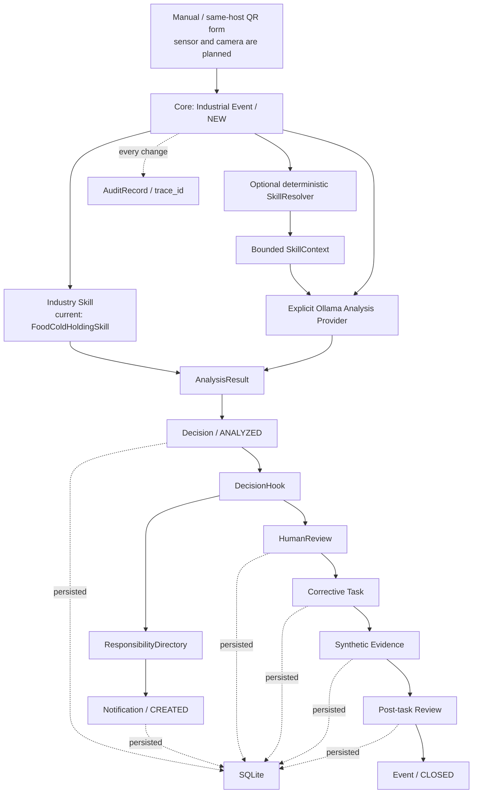

# AlphaNoah System Overview

## 当前目标

AlphaNoah 是一个工业现场 Agent，不是食品管理系统。产品方向是：

> 员工通过二维码低门槛反馈现场问题 → AI 辅助分析异常 → 连接负责人处理 → 提交证据 → 复查并形成可审计闭环。

AlphaNoah is an industrial field Agent runtime, designed for extensible
industrial skills.

AlphaNoah v0.2 当前实现本地、确定性的通用闭环 Runtime、统一工业 Event
envelope、同机 QR/Web 申报入口、显式 Ollama Analysis Provider、确定性责任
匹配、本地通知 outbox，以及最小确定性 Skill-guided analysis 边界。合成餐饮
冷藏温度异常是 **First validation skill**，
用于验证 Runtime，不是产品范围。当前 AI 输出是待人工确认的初步建议，不是
设备诊断。

演示数据全部标记为：

```text
Synthetic demo data
Not a real production incident
```

## 当前架构



## 状态清单

| 层级 | 状态 |
|---|---|
| Implemented | 工业 Event、核心对象、Food 规则 Skill、最小 Skill 合同与确定性解析、同机 QR/Web 表单、Ollama Provider、DecisionHook、责任匹配、本地通知 outbox、人工确认、任务/证据/复查、SQLite、审计链、CLI、测试 |
| Directly verified | Windows 118 项测试及 Task 05A 离线 QR-to-CLOSED 黄金路径；Task 03B 一次 AMD Linux `qwen3.5:9b` 结构化分析 |
| Partially implemented | 人工确认无 Web 页面；QR 无物理手机访问；GPU 证据不是 benchmark；Notification 只到 `CREATED`；Task 不由 AI 自动创建 |
| Designed only | 图片输入、AssetLookup、双模型、Memory/Vector DB |
| Not implemented | 完整 Skill 平台、LLM Skill 选择、外部消息发送、FastAPI、OpenWebUI、RAG、Embedding、Vector DB、多 Agent、设备控制、生产认证 |

## 责任边界

| 节点 | 输入 | 输出 | 负责人 | 可失败 | 恢复 | 人工确认 | 记录/复现 | 演示 |
|---|---|---|---|---|---|---|---|---|
| Event ingestion | 工业 Event 契约 | `Event/NEW` | Runtime | 是 | 重新提交 | 否 | SQLite + fixture | 是 |
| Skill analysis | normalized input | `Decision` | 规则 Skill | 是 | `FAILED→NEW` | 否 | rule ID + audit | 是 |
| Provider analysis | Industrial Event | `AnalysisResult` | Ollama Provider | 是 | `FAILED→NEW` | 输出必须要求人工确认 | model tag/digest + audit | 是 |
| Skill resolution | Event type + optional asset type | bounded `SkillContext` | 确定性 Resolver | 是 | 修正定义/Event 后重试 | 不由模型选择 | Skill ID/version/reason | 合成 |
| DecisionHook | validated Decision | 路由动作 | 确定性代码 | 是 | 人工处理 | 决策后需要 | policy + audit | 是 |
| Responsibility | Event + reviewed directory | `ResponsibilityAssignment` | 确定性代码 | 否 | `UNASSIGNED` | 不由模型选择 | JSON fixture + tests | 是 |
| Notification outbox | Assignment + Decision | `Notification/CREATED` | 本地 outbox | 是 | 幂等返回原记录 | 不代表送达 | SQLite + audit | 是 |
| HumanReview | 待确认 Decision | approve/reject/revise | `human:*` actor | 是 | revised/重新发起 | 必须 | reviewer + time | 是 |
| Task | approved Decision | 整改任务 | Runtime/assignee | 是 | cancel/fail/resume | 已完成 | SQLite + audit | 是 |
| Evidence | task result | Evidence | assignee | 是 | 幂等重试 | 否 | ref + idempotency | 是 |
| Review | evidence | close/more/fail | 规则或人 | 是 | 补证据 | 不冒充先前批准 | review record | 是 |
| Archive | 全部对象 | trace timeline | SQLiteStore | 是 | 数据库重开 | 否 | `trace_id` | 是 |

## 非目标

当前不是完整平台，不提供生产权限、安全认证、真实工业或食品安全判断、
Equipment Skill、外部消息发送、物理手机访问、审批 Web 页面、自动重大决策
或设备控制。本地 Notification 只是待发送记录，不是送达证明。Task 03B 只
验证一条合成工业 Event 的本地模型分析，不证明通用设备诊断能力。

## Runtime 与行业边界

| 边界 | v0.2 当前责任 |
|---|---|
| Core Runtime | Event、Decision、DecisionHook、HumanReview、Task、Evidence、Review、AuditRecord、SQLite 持久化 |
| Responsibility/outbox | 静态目录匹配、`UNASSIGNED`、Notification `CREATED` 和审计；不发送消息 |
| Industry Skill | 领域输入校验、分析策略、任务模板、复查策略 |
| Skill guidance boundary | 不可变定义、确定性选择、有界分析约束、知识提示和审计；不执行工具 |
| First validation skill | Food SOP 合成场景 |
| 后续候选 Skill | Equipment Maintenance、Quality Inspection、Safety Inspection；均未实现 |

## Industrial Event 输入

| 类型 | 字段 |
|---|---|
| 新工业输入必需 | `event_type`、`source`、`description` |
| 可选上下文 | `timestamp`、`location`、`asset_id`、`reporter`、`attachments`、`metadata` |
| 保留兼容字段 | `raw_input_ref`、`normalized_input` |

`event_type` 是受约束的 snake_case 字符串，不是封闭行业枚举。Core 只校验
字段形状和 JSON 可持久化性，不根据具体事件类型执行行业分支。

## Task 05A 应用编排

Task 05A 提供一个合成“餐厅 A08 包厢闭店后空调仍运行”技术演示。它通过现有
QR 输入适配器创建 Event，确定性选择 `restaurant-aircon-shutdown`，检索已有
合成知识，经 `ReliableAnalysisProvider` 校验后停在强制人工审核。只有显式
批准、显式任务执行和显式证据复核后，现有 Runtime 才会进入 `CLOSED`。

该编排位于应用/演示层，不新增状态机、数据库表或设备控制。餐厅规则、合成
actor、任务模板和证据引用没有写入 Core Runtime。
