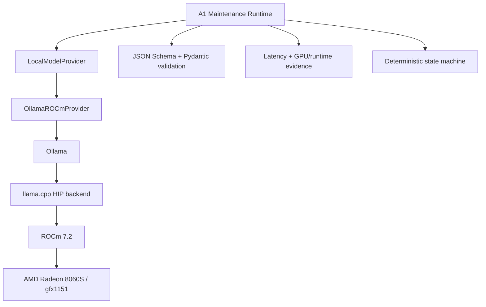

# AMD ROCm Local Runtime

> **AlphaNoah A1 Edge Agent** — *An AMD ROCm-powered industrial asset maintenance edge agent.*

Document status: runtime decision and single-machine audit baseline for hackathon v0.1. This documentation task did not install software, change Linux/ROCm/Ollama configuration or rerun the benchmark.

## 1. Runtime Goal

The hackathon runtime is designed to perform incident interpretation locally on an AMD Radeon GPU through ROCm. Local execution supports an offline demo, keeps simulated operational records on the node and makes GPU/runtime evidence visible to the audience.

Ollama is the current inference backend, not the Agent framework and not the core domain architecture. The Agent runtime depends on a `LocalModelProvider` port so the backend can be replaced after the competition.

## 2. Audited Prototype Baseline

### 2.1 Target environment

| Component | Current prototype baseline supplied to this task |
|---|---|
| Processor | AMD Ryzen AI Max+ 395 |
| GPU | AMD Radeon 8060S |
| GPU architecture | `gfx1151` |
| Operating system | Reported Ubuntu 24.04.4 LTS, kernel `7.0.0-28-generic` |
| Compute stack | Reported ROCm 7.2.0 |
| Current model service | Reported Ollama 0.20.3 |
| Inference backend path | llama.cpp HIP backend |
| Data path | Local model inference; no cloud API required for the demo path |

### 2.2 Observed single-machine results

The environment-audit summary supplied with the architecture task reports:

- `rocminfo` identified `gfx1151`;
- GPU utilization rose from approximately 1% idle/background level to approximately 91% during one reported inference observation;
- an Ollama request was reported to execute on the AMD GPU;
- warm-response latency was reported as approximately 1.7–2.7 seconds for the described prototype workload;
- disabling Thinking was reported to improve throughput;
- direct Transformers loading did not complete within the reported 300-second observation window.

> Reported as working, but not independently evidenced in the supplied audit material.
> These figures are report summaries from one prototype machine, not a general
> performance commitment or an independently reproduced benchmark.

The raw command logs, model identity/revision, prompt/output sizes, sampling configuration and ten-run latency samples are not present in this repository. They must be added by a human reviewer before the figures are used in a public benchmark claim. Use the [environment audit template](../experiments/AMD395_ENVIRONMENT_AUDIT_TEMPLATE.md), the [inference benchmark template](../experiments/ROCM_INFERENCE_BENCHMARK_TEMPLATE.md), and the [experiment record guide](../experiments/EXPERIMENT_RECORD_GUIDE.md) to collect that evidence. This document preserves the supplied baseline without pretending that this documentation task independently reproduced it.

## 3. Runtime Architecture



### 3.1 `LocalModelProvider` boundary

The provider contract should expose backend-neutral operations such as:

- `health`: local service, model and device readiness;
- `generate_structured`: bounded request with a declared response schema;
- `warmup`: explicit model load and readiness probe;
- `model_metadata`: model, backend, ROCm and device identity;
- `metrics_snapshot`: latency and device observations with source/units;
- `shutdown` or lease release where supported.

The contract must not expose Ollama-native response objects to domain Skills. Provider errors are translated into stable timeout, unavailable, invalid-output and device-unavailable categories.

### 3.2 `OllamaROCmProvider` responsibilities

- map the neutral request into the local Ollama API;
- set bounded prompt/output and timeout options;
- request non-streaming structured output for deterministic parsing unless the UI explicitly needs streaming;
- apply `keep_alive` for the model-resident competition path;
- capture backend/model metadata and safe latency metrics;
- refuse non-loopback endpoints in the offline demo configuration;
- return raw model text only to the validation boundary, not directly to state transitions.

## 4. Runtime Choice

### 4.1 Why Ollama for the hackathon

- the supplied machine audit reports local AMD GPU execution;
- the existing runtime path is reported to have operational behavior on the prototype;
- model service lifecycle and `keep_alive` reduce repeated load costs;
- a local HTTP boundary keeps the Agent Core independent of model-process crashes and Python model dependencies;
- the two-week schedule favors stabilizing one verified path rather than migrating backends.

### 4.2 Why not vLLM during the competition

vLLM is not rejected as a future backend. It is deferred because a migration would add installation, model-compatibility, memory, startup and operational validation work without being required to prove the bounded Agent workflow. The repository must not claim that vLLM support or migration is complete.

Evaluate vLLM after the hackathon only if:

- target models and `gfx1151` are verified on a pinned stack;
- concurrency or throughput data shows a real need;
- cold/warm behavior, memory pressure and structured-output reliability are compared under the same benchmark;
- the Provider contract can be preserved;
- offline, health, timeout and failure-recovery tests pass.

### 4.3 Why not direct Transformers loading for the main demo

The supplied audit reports that one direct Transformers load did not complete
within 300 seconds. A different planning document estimates a 30–60 second start,
so the general cold-start duration is unresolved. The competition path should not
depend on direct loading until a reproducible measured run resolves this conflict.

## 5. Competition Optimizations

### 5.1 Model lifecycle

- keep the selected model resident for the demo session;
- use an explicit `keep_alive` value instead of relying on an unknown default;
- run one startup warmup request and expose readiness only after schema-valid output;
- record cold load separately from warm inference;
- avoid changing models during the judged flow.

### 5.2 Request bounds

- keep the system/task prompt concise and versioned;
- retrieve only asset-scoped evidence relevant to the current step;
- cap employee input, history items and simulated SOP excerpts;
- limit output tokens to the schema's needs;
- disable unnecessary Thinking for the measured competition path;
- use deterministic sampling settings appropriate for structured extraction and record them in benchmark metadata.

### 5.3 Structured-output handling

1. request JSON matching the declared Skill output;
2. parse JSON without executing model-produced text;
3. validate with JSON Schema and the planned Pydantic domain schema;
4. on a format-only error, retry once with the validation error and the same bounds;
5. after the retry, return an explicit `invalid_model_output` failure;
6. never infer a successful state transition from malformed text.

### 5.4 Service reliability

- use an explicit inference timeout;
- check Ollama service, model availability and device metadata at startup;
- use bounded concurrency suitable for the audited single machine;
- record provider failures without silently switching to a cloud API;
- allow a clearly labeled mock only for unit tests, never for the ROCm proof;
- verify the complete demo once with network access disabled.

## 6. Metrics and Evidence

The demo should display evidence, not marketing-only badges.

| Metric or identity | Required metadata |
|---|---|
| Device | GPU name and `gfx1151` identity |
| Runtime | OS, ROCm, Ollama and backend versions |
| Model | name, revision/hash where available, quantization and context settings |
| Load | model load/cold-start duration |
| Inference | provider latency for each measured request |
| End-to-end | Skill/task latency separated from provider latency |
| GPU / UMA | utilization plus available VRAM or unified-memory/UMA occupancy with command/source and units |
| Reliability | success count, schema-valid count, timeout/failure count |
| Network | endpoint class and `Cloud API Calls: 0` evidence for the offline run |

Unavailable metrics must be displayed as unavailable. They must not be filled with zero or guessed values.

## 7. Benchmark Protocol

The benchmark is planned; it has not been run by this documentation task.

```text
1. Record machine, OS, ROCm, Ollama, backend and model identity.
2. Start the model service and record cold load/readiness time.
3. Run one schema-valid warmup request; exclude it from warm statistics.
4. Execute the fixed structured incident prompt ten times sequentially.
5. Record every latency, schema result, error and GPU observation.
6. Report mean, median and P95 with the exact P95 method.
7. Run the bounded end-to-end demo once with network disconnected.
8. Preserve the raw, non-sensitive measurements for review.
```

Minimum stability evidence:

- ten attempted runs and an explicit success count;
- no silent cloud fallback;
- all successful responses pass the same schema;
- model and GPU identity visible;
- GPU utilization and available VRAM/UMA occupancy recorded from a named measurement source;
- mean and P95 computed from raw samples;
- warm results not mixed with cold load;
- an offline run demonstrating `Cloud API Calls: 0`.

No universal latency threshold is declared until the complete reproducible audit evidence is present.

## 8. Failure Modes

| Failure | Runtime behavior |
|---|---|
| Ollama unavailable | Provider health fails; task enters explicit recoverable failure |
| Model not loaded | warmup/readiness remains false; do not begin judged flow |
| ROCm/GPU not detected | fail the ROCm evidence gate; do not present CPU/mock output as GPU output |
| Inference timeout | stop waiting, persist timeout, offer bounded retry or human fallback |
| Invalid JSON/schema | retry formatting once, then fail explicitly |
| GPU metric unavailable | show unavailable with reason; inference result may continue if device proof remains valid |
| Network disconnected | local path must continue; any attempted remote endpoint is a failed demo criterion |

## 9. Security Boundary

- The provider endpoint is local-only for the competition configuration.
- Prompts contain only simulated asset/SOP/work-order data.
- No API key, token, `.env`, model weight or private prompt belongs in this repository.
- Model weights remain outside Git and require separate provenance/license review.
- Runtime logs must avoid full raw employee text where a safe event reference is enough.
- Ollama is replaceable infrastructure; no domain record depends on it.

## 10. Current Implementation Boundary

The repository now implements a deterministic local business runtime and validates
the rule/model-shaped `AnalysisResult` before state changes. It does not implement
`LocalModelProvider`, `OllamaROCmProvider`, model warmup/health checks, AMD metrics
collection or the ROCm benchmark harness. It also does not install or reconfigure
Ollama, ROCm, Linux, vLLM, Transformers or a model. The supplied single-machine
baseline remains historical documentation evidence awaiting raw-log attachment
if the AMD integration task is activated.
