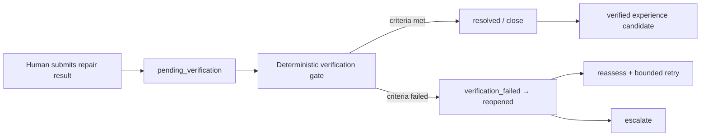

# ADR-0004: Keep Memory Local and Require Human Confirmation plus Outcome Verification

> **AlphaNoah A1 Edge Agent** — *An AMD ROCm-powered industrial asset maintenance edge agent.*

## Status

Accepted for hackathon v0.1

Decision date: 2026-07-22 
Implementation status: local SQLite records, explicit human confirmation and
post-task verification are implemented for the synthetic food-SOP workflow.
Production data policy, production authorization and advanced memory remain
unimplemented.

## Context

Industrial maintenance combines sensitive operational records, uncertain model output and physical actions whose real outcome cannot be inferred from text alone. A model can help interpret and recommend, but it cannot verify that a technician completed a repair or that a machine remained stable afterward.

If model recommendations were written directly into long-term memory as successful experience, future tasks could amplify an unverified claim. If high-impact actions bypassed a human gate, the system would also confuse language generation with authority.

## Decision

1. Operational records remain local by default.
2. Model suggestions are proposals and cannot directly become verified experience.
3. High-impact actions require a persisted human confirmation.
4. A work order can close only after an explicit `VerificationResult` satisfies deterministic criteria and any required approval.
5. Failed verification can reopen, retry or escalate the work order.
6. Only verification-supported root causes and outcomes may enter Long-Term Experience Memory.

The responsibility split is:

> LLMs interpret and recommend; deterministic code controls state and execution; humans approve high-impact actions and verify physical outcomes.

## Local Memory Boundary

Local-by-default applies to:

- employee descriptions;
- simulated SOP and manual excerpts;
- work orders and repair submissions;
- model request/response records subject to retention rules;
- approvals, verification and audit logs;
- raw archive and experience summaries.

A future server may receive minimized, approved summaries through a separately designed synchronization contract. Raw evidence is not automatically uploaded.

## Human Confirmation Gate

An approval record includes:

- approval ID and owning task/work order;
- exact proposed action and action hash;
- risk/policy version;
- allowed approver role;
- decision, actor and timestamp;
- expiry and any conditions.

Changing the action invalidates the old approval. The model cannot create an approval decision, impersonate an approver or resume a gated state without a valid record.

## Verification Gate

Verification compares declared post-repair observations with explicit criteria. It records success, failure or insufficient evidence and links the evidence used.

For the simulated packaging-machine demo, “stable operation for the declared observation period” is a simulated verification input. It is not a real industrial safety criterion or customer SOP.

## Experience Promotion

A candidate may enter L3 only when it has:

- an asset-scoped source work order;
- a human-authored repair result;
- a verification result;
- root-cause/outcome provenance;
- schema and policy validation;
- human review when the policy requires it.

Failed attempts remain useful negative evidence, but are labeled ineffective or unresolved. They cannot be presented as successful solutions.

## Reasons

- protects simulated and future enterprise data by default;
- preserves human authority over physical/high-impact actions;
- prevents model suggestions from becoming self-confirming memory;
- makes close/reopen behavior observable to judges;
- supports offline operation and auditable recovery.

## Consequences

Positive:

- clearer safety and accountability boundary;
- higher-quality long-term experience;
- visible closed-loop differentiation from a chatbot;
- no cloud dependency for the critical path.

Negative:

- the workflow pauses when an authorized human is unavailable;
- approval expiry, resume and idempotency must be implemented carefully;
- verification criteria and evidence capture need explicit design;
- local retention, backup and access control remain implementation responsibilities.

## Failure Handling

| Condition | Decision |
|---|---|
| Approval rejected | Persist rejection and escalate or stop according to policy |
| Approval expires | Remain blocked; issue a new request if still applicable |
| Repair result missing | Stay `in_progress`; do not verify or close |
| Verification evidence incomplete | Stay `pending_verification` or request more evidence |
| Verification fails | Mark `verification_failed`, then reopen/reassess |
| Retry unsafe or exhausted | Escalate; do not let the model increase the budget |
| Local store unavailable | Stop stateful effects and report recoverable failure |

## Alternatives Considered

### Let the model close the ticket

Rejected. Language output cannot prove a physical outcome or satisfy authorization.

### Store all model suggestions as long-term experience

Rejected. It would erase the distinction between recommendation and verified result.

### Require cloud synchronization before every step

Rejected for the local-first offline demo and privacy boundary.

## Public Repository Boundary

Only simulated assets, records, guidance and approvals may appear in this repository. The ADR does not disclose a real customer policy, production retention period, proprietary prompt or AlphaNoah commercial server design.
